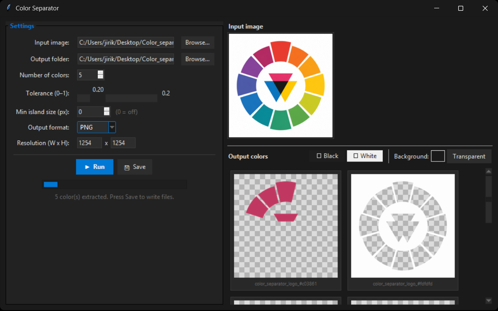

# Color Separator

Color Separator is a desktop Python app that extracts dominant colors from an image and exports each color cluster as a separate output image.

## Disclaimer

This program is **fully vibe-coded** because I needed this feature, and most online tools are either paywalled or do not work.

This tool is mainly intended for images with **solid colors** (logos, symbols, etc.). At least for me, the main use case is converting multi-colored logos to PCBs in KiCad. I have also created a basic PCB art guide.

## Features

- Extracts color clusters using K-means.
- Supports PNG and SVG inputs.
- Optional island cleanup to remove very small pixel fragments.
- Output transform controls:
	- Recolor extracted objects to black or white.
	- Custom background color.
- Save outputs as PNG, JPEG, BMP, or SVG.
- SVG mode supports vector-native SVG separation and SVG export.



## Required Packages

### Python

- Python 3.10+ recommended.

### Python packages

- Pillow
- numpy
- scipy
- scikit-learn
- pymupdf
- lxml

`tkinter` is required for the GUI and is usually included with standard Python on Windows.

## Install Dependencies

From the project folder:

```powershell
py -m venv .venv
.\.venv\Scripts\Activate.ps1
python -m pip install --upgrade pip
pip install pillow numpy scipy scikit-learn pymupdf lxml
```

## Run the App (Python)

From the project folder:

```powershell
python separator.py
```

## Build Executable with PyInstaller

If you want an executable of this program, you can download one directly from Releases. If you prefer to build your own, follow these steps:
Install PyInstaller:

```powershell
pip install pyinstaller
```

Build one-file Windows executable:

```powershell
py -m PyInstaller --noconfirm --clean --windowed --onefile --name ColorSeparator --icon color_separator_logo.ico --collect-all sklearn --collect-all scipy --collect-all lxml --collect-submodules fitz separator.py
```

The executable will be created at:

- `dist\ColorSeparator.exe`
